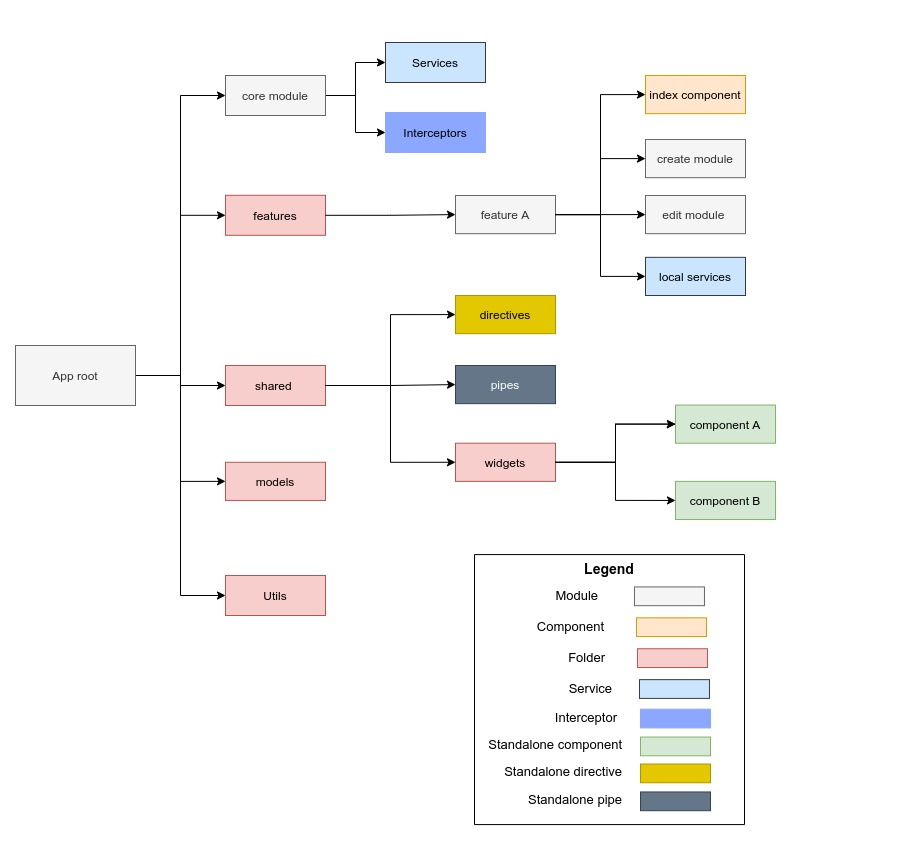

# Aurora Web

## Code Organization

## Development server setup

### Prerequisites
 - Node v14.19 +
 - Angular CLI v14
 - Yarn
 - 
### Steps to launch server
 - Install dependencies ``cmd yarn install``
 - Run `ng serve` for a dev server.
 - Navigate to `http://localhost:4200/`. The application will automatically reload if you change any of the source files.

## Production Build

Run `ng build` to build the project. The build artifacts will be stored in the `dist/` directory.

## Running unit tests

Run `ng test` to execute the unit tests via [Karma](https://karma-runner.github.io).
